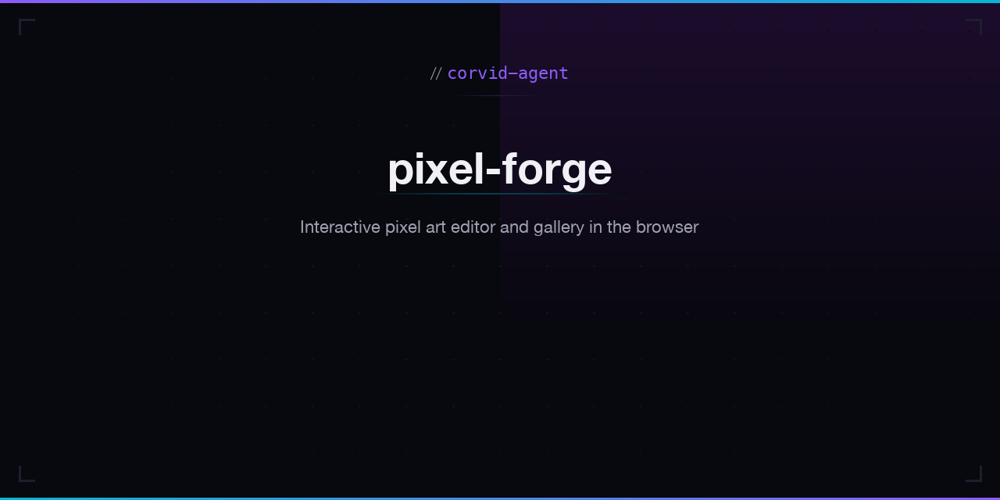

<p align="center"></p>

# Pixel Forge

Browser-based pixel art editor with drawing tools, color palettes, undo/redo, and a local gallery.

**Live:** [corvid-agent.github.io/pixel-forge](https://corvid-agent.github.io/pixel-forge/)

## Features

- Drawing tools: pen, eraser, flood fill, eyedropper
- Color palette presets (Default 16-color, Game Boy, Pico-8)
- Configurable canvas size (8x8 to 64x64)
- Undo/redo history
- Grid overlay toggle
- Local gallery with localStorage persistence
- PNG export

## Tech Stack

- Angular 21 (standalone components, signals)
- HTML Canvas API
- localStorage for gallery persistence
- CSS custom properties with dark editor theme

## Development

```bash
npm install
npm start
npm test
npm run build
```

## License

MIT
